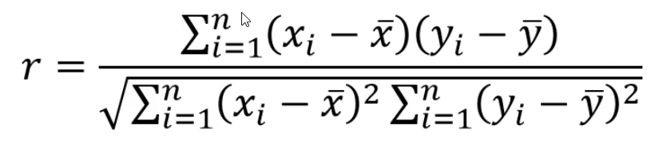

# ML Concepts

*ML
The Machine Learning aims to help understand how to build models to capture the relationships between variables and a known outcome (that can be continuous or categorical), how to identify patterns in data that are not labeled, and how to gain business insights from the model.

- Underfitting - Less useful information; Doesn't capture enough information to predict a model
- Overfitting - Information + noise ; Capture noise which will not repeat itself and make bad prediction 

#NOTES

**“In machine learning, *noise* refers to random fluctuations or errors in data that can arise from various sources, like measurement errors, recording errors, or any other inconsistencies.” it is unstructured, random, and not repeat itself**

**“A mathematical model in the context of machine learning refers to a mathematical construct or representation of the patterns or relationships within the data.”**

**“Data science involves extracting insights from complex data and facing challenges like data quality, data integration, etc.**

**Overfitting occurs when a model learns the training data too well while underfitting happens when the model fails to capture underlying patterns.**

**Machine learning enables computers to learn from data, where supervised learning learns from labeled data, and unsupervised learning learns from unlabeled data.”**

# Data Science

- It is all about learning from Data 

# Data -> 
1. Training set(70%)
2. Testing set(30%) 

# Supervised Learning:

- Building mathematical model using data that contains both the input and the desired outputs. It should have labeled data
    - Regression: desired output is a continuous number (eg. 1,2,5,10,30...)
    - Classification: desired output is a category (eg. yes or no)

# Semi-Supervised Learning:

- Building mathematical model using data that contains both the input and the desired outputs. It should have partial labeled data

# Unsupervised learning:

- Building mathematical model using data that contains Only input and no desired outputs. It should not have labeled data

    - Clustering: Grouping data
    - Dimensionality reduction: Compressing data, objective is reduce the size of a file without removing   any information which is called compressing, and then using the information to reconstruct the file(eg. could be used in stock market)
    - Association rule learning: If X then Y 

<start and finish upto 1.5>

# Correlation:
 - Relation between two variables
    
# Pearson's correlation coefficient
 - Correlation: A statistical measure that quantifies the strength and direction of the linear relationship between two continuous variables but doesn't provide a way to predict the output given an input.

 - A linear realtionship between two variables is one in which the rate of change between the two is constant. Example: The relationship between the distance traveled and the time taken at a constant speed. 

- Continuous variable can take any value within a given range and are often measured. Examples include height, weight, and temperature. 

- Correlation helps in quantifying relationships between variables, and hence it is a very popular technique to measure the degree of association.

- Correlation is unitless because the units in the numerator and denominator(while calculating correlation) cancel out each other, giving us a unitless measure.

- Correlation does not imply causation, it just signifies the relationship. The cause may or may not be the variables themselves.

- Variance measures the dispersion of a set of data points around their mean value. It is the square of the standard deviation. 

x_ -> average of x

 - Examples of positive correlation:
    - Height and weight: As height increases, weight also increases. 
    - Education and income: Higher levels of education often correlate with       higher income levels.  

# Causation
 - Causation indicates that one event is the result of the occurrence of another event; there is a casual realtionship between the two events. Example: smoking causes an increase in the risk of lung cancer. 

 - Correlation is NOT EQUALS to Causation

